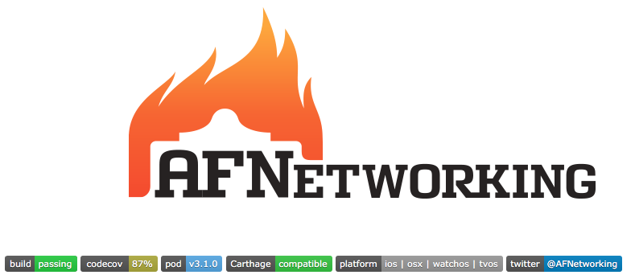

## Let's Frame that Work

---

# Quem vos fala

Nome: Igor Ferreira

Cargo: iOS Developer

Empresa: [Future Workshops](http://futureworkshops.com)

---


---

# Bibliotecas

---

# Sistema

* [Foundation](https://developer.apple.com/reference/foundation)
* [UIKit](https://developer.apple.com/reference/uikit)
* [CoreData](https://developer.apple.com/library/content/documentation/Cocoa/Conceptual/CoreData/index.html?utm_source=iosstash.io)

---

# Open source

* [Alamofire](https://github.com/Alamofire/Alamofire)
* [NibDesignable](https://github.com/mbogh/NibDesignable)
* [Mantle](https://github.com/Mantle/Mantle)

---

# Produto

* [Scanbot](https://scanbot.io/en/sdk.html)
* [PSPDFKit](https://pspdfkit.com)
* [Facebook](https://developers.facebook.com/docs/ios/)
* [Firebase](https://firebase.google.com/docs/ios/setup)

---

# Swift

---


---


---

```
MyFramework.framework/
    MyFramework  -> Versions/Current/MyFramework
    Resources    -> Versions/Current/Resources
    Versions/
        A/
            MyFramework
            Resources/
                English.lproj/
                    InfoPlist.strings
                Info.plist
        Current  -> A
```


---


---


---

* Not Embeded

```
dyld: Library not loaded: @TestFramework
  Referenced from: /var/mobile/Applications/App.app/TestFramework
  Reason: image not found
```  

* Multiple versions

```
dyld: could not load inserted library '/TestFramework.framework/TestFramework' because no suitable image found.  
  Did find: /private/var/mobile/Containers/Data/Application/TestFramework.framework/TestFramework
```

---

# ⌘ + ⌥ + /

---



---

## Fundamentos:

* [LLVM](http://llvm.org)
* [Frameworks](https://developer.apple.com/library/content/documentation/MacOSX/Conceptual/BPFrameworks/Frameworks.html)
* [Using Dynamic Libraries](https://developer.apple.com/library/content/documentation/DeveloperTools/Conceptual/DynamicLibraries/100-Articles/UsingDynamicLibraries.html)
* [Run path dependent libs](https://developer.apple.com/library/content/documentation/DeveloperTools/Conceptual/DynamicLibraries/100-Articles/RunpathDependentLibraries.html)

---

## Distribuição:

* [CocoaPods](https://cocoapods.org)
* [Carthage](https://github.com/Carthage/Carthage)

---

# Pt-BR

* [EquinociOS - Bibliotecas](http://equinocios.com/library/2016/03/17/bibliotecas/)
* [EquinociOS - Frameworks](http://equinocios.com/frameworks/2016/03/26/criando-frameworks/)
